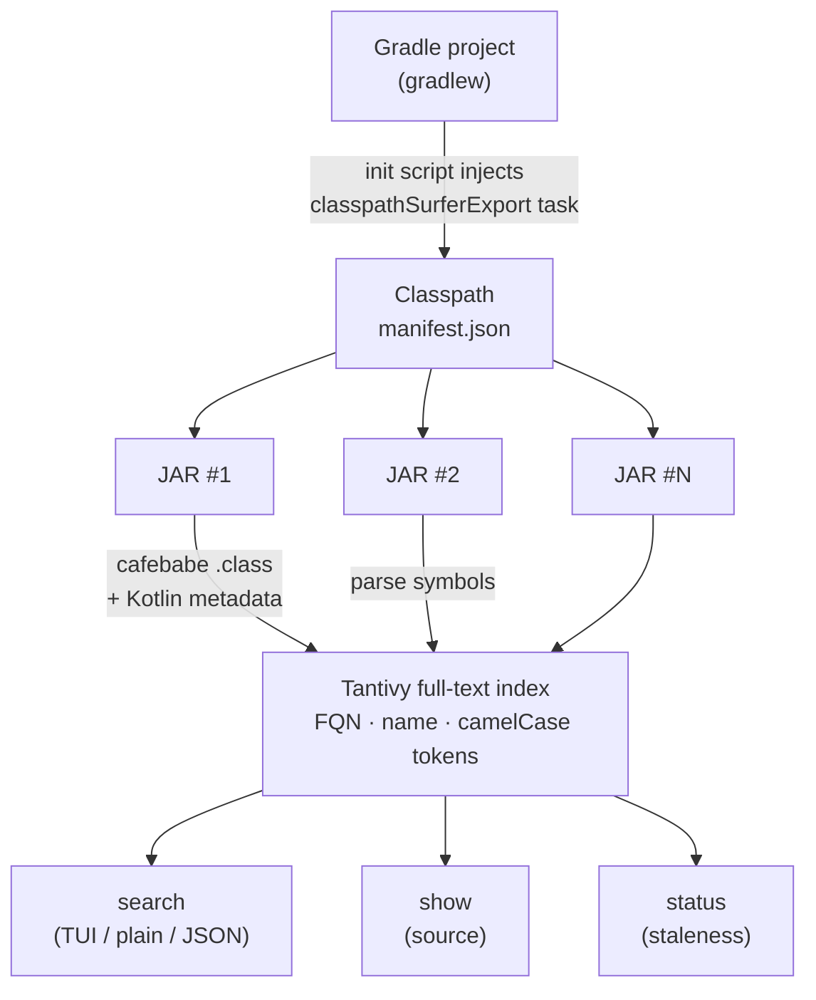

<div align="center">

# classpath-surfer

**Fast dependency symbol search for Gradle Java/Kotlin projects**

[](https://github.com/rscarrera27/classpath-surfer/actions/workflows/ci.yml)
[](LICENSE)
[](https://www.rust-lang.org/)

Index every class, method, and field from your resolved classpath,<br>
then search them instantly — from the CLI or directly inside [Claude Code](https://claude.ai/claude-code).

[English](README.md) | [한국어](README_ko.md)

<!-- TODO: Add demo GIF here — record TUI search + show with asciinema + agg -->

</div>

> [!WARNING]
> This project is in **alpha** stage. APIs, CLI flags, index format, and configuration schema are subject to breaking changes without notice. Use at your own risk and expect rough edges. Bug reports and feedback are very welcome!

---

## Why

Coding agents (like Claude Code) working on Gradle Java/Kotlin projects repeatedly struggle with external library symbols — blindly crawling `~/.gradle/caches/`, accessing artifacts outside the actual classpath, decompiling classes when source JARs exist, and rediscovering this fragile workflow from scratch every time.

**classpath-surfer** solves this by building a local [Tantivy](https://github.com/quickwit-oss/tantivy) full-text index over all symbols in your resolved classpath. Agents (and humans) can search symbols and read source code instantly.

## Features

| | Feature | Description |
|---|---------|-------------|
| :mag: | **Symbol search** | Smart search with auto FQN detection, CamelCase token splitting, and prefix matching — filter by kind, dependency, access level, or configuration scope |
| :zap: | **Fast indexing** | Auto-extract Gradle project classpath and index all symbols in seconds; incremental updates via GAV-level diff |
| :globe_with_meridians: | **Kotlin signatures** | Decode `@kotlin.Metadata` protobuf to display native Kotlin signatures like `suspend fun` and `data class` |
| :package: | **JVM-language agnostic** | Java, Kotlin, Scala, Groovy, Clojure — search symbols from dependencies written in any JVM language |
| :page_facing_up: | **Source code lookup** | Auto-focus on a symbol with surrounding context; source JARs when available, otherwise on-demand CFR/Vineflower decompilation — Kotlin shows original `.kt` source with a secondary decompiled Java view |
| :robot: | **AI agent integration** | `--agentic` JSON output with classified exit codes for any AI agent; optional Claude Code plugin for slash-command skills |

## Quick Start

### Install

> [!NOTE]
> Pre-built binaries are currently available for **Apple Silicon (aarch64) only**. For other platforms or building from source, see [CONTRIBUTING.md](CONTRIBUTING.md).

```bash
brew install rscarrera27/tap/classpath-surfer
```

### Set up a project

```bash
cd your-gradle-project
classpath-surfer init      # writes config, Gradle init script, then runs initial refresh

# Verify the index was built
classpath-surfer status
# → 38 dependencies, 77,219 symbols indexed, 2.1 MB on disk
```

### Find a symbol

```bash
# Search by name
classpath-surfer search ImmutableList

# CamelCase token matching — finds ImmutableList, ImmutableMap, ImmutableSet, etc.
classpath-surfer search Immutable

# Find coroutine launchers in kotlinx-coroutines
classpath-surfer search launch --type method --dependency "org.jetbrains.kotlinx:*"

# Regex search for HTTP client classes
classpath-surfer search "Http.*Client" --regex --type class

# Filter by configuration scope
classpath-surfer search Annotation --type class --scope compileClasspath

# FQN-like queries are auto-detected
classpath-surfer search com.google.common.collect.ImmutableList
```

### Read the source

```bash
# Show source — auto-focuses on the symbol with 25 lines of context
classpath-surfer show com.google.common.collect.ImmutableList
classpath-surfer show com.google.common.collect.ImmutableList.of

# Widen context / show the full file
classpath-surfer show com.google.common.collect.ImmutableList --context 50
classpath-surfer show com.google.common.collect.ImmutableList --full

# Kotlin sources display original .kt files (suspend fun, data class, etc.)
classpath-surfer show kotlinx.coroutines.CoroutineScope
```

If a `-sources.jar` is available it will be used; otherwise the class is decompiled with CFR (default) or Vineflower.

### Browse dependencies

```bash
# List indexed dependencies with symbol counts and scopes
classpath-surfer deps

# Filter by GAV pattern
classpath-surfer deps --filter "io.netty:*"

# Show only runtime dependencies
classpath-surfer deps --scope runtimeClasspath
```

### AI agent / script integration

```bash
# All commands support --agentic for structured JSON output
classpath-surfer search ImmutableList --agentic
classpath-surfer show com.google.common.collect.ImmutableList --agentic

# Non-TTY automatically outputs plain text (pipe-friendly)
classpath-surfer search ImmutableList | head
```

## Commands

| Command | Description |
|---------|-------------|
| `init` | Install Gradle init script, default config, and run initial refresh |
| `refresh` | Extract classpath via Gradle and build/update the symbol index (skips Gradle when fresh; use `--force` to override) |
| `search <query>` | Search for symbols in the index |
| `show <fqn>` | Display source code for a symbol (focuses on the target symbol by default) |
| `deps` | List indexed dependencies with symbol counts |
| `status` | Show index stats (dependency count, symbol count, staleness, disk size) |
| `clean` | Remove index data |
| `--agentic` | Global flag: emit structured JSON output for AI agents and scripts |

## Performance

Benchmarked on Macbook Pro 2023(M2 Pro, 32GB) with a 38-dependency project (77,219 symbols including Guava, Spring Core, Ktor, kotlinx-coroutines, OkHttp, and more):

### Search latency

| Query type | Latency |
|-----------|---------|
| Simple keyword (`ImmutableList`) | **83 µs** |
| FQN exact match | **10 µs** |
| Regex (`Immutable.*`) | **350 µs** |
| With type filter | **73 µs** |
| With dependency filter | **92 µs** |

### Indexing speed

| Operation | Time |
|-----------|------|
| Full refresh (38 deps, 77K symbols) | **1.76 s** |
| Incremental refresh (1 dep removed) | **607 ms** |
| No-op refresh (up to date) | **537 ms** |

<details>
<summary>Reproduce these benchmarks</summary>

```bash
cargo bench --bench search
cargo bench --bench refresh
```

</details>

## How It Works



1. **Extract** — A Gradle init script resolves `compileClasspath` and `runtimeClasspath` for every subproject, writing a per-module JSON manifest with each dependency's GAV coordinates and JAR paths (including source JARs when available).
2. **Parse** — Each JAR is opened with the `cafebabe` crate. Every `.class` file is parsed to extract class names, methods, fields, descriptors, and access flags. For Kotlin classes, the `@kotlin.Metadata` annotation is decoded via protobuf (prost) to produce Kotlin-native signatures. The `SourceFile` attribute is used to detect the source language.
3. **Index** — Extracted symbols are written into a Tantivy index with fields for FQN, simple name, camelCase-split tokens, kind, signature, and GAV.
4. **Search** — Queries hit the Tantivy index. Results are ranked by relevance and returned as a table or JSON.
5. **Staleness** — On each search, the tool checks lockfile hashes and build-file mtimes against the snapshot taken at index time. If anything changed, it asks you to `refresh`.

## Claude Code Integration

classpath-surfer ships as a [Claude Code plugin](https://claude.ai/claude-code) with three skills:

| Skill | Usage |
|-------|-------|
| `/find-symbol <name>` | Search for a symbol and display results as a table |
| `/show-source <fqn>` | Show source code for a fully qualified symbol |
| `/refresh-deps` | Re-index dependencies after a version bump |

### Install the plugin

```bash
# Inside Claude Code
/plugin marketplace add github.com/rscarrera27/classpath-surfer
/plugin install classpath-surfer
```

This lets Claude Code discover and read dependency APIs without you having to look them up manually.

## Configuration

`classpath-surfer init` writes `.classpath-surfer/config.json`:

```json
{
  "decompiler": "cfr",
  "decompiler_jar": null,
  "configurations": ["compileClasspath", "runtimeClasspath"],
  "java_home": null
}
```

| Field | Description |
|-------|-------------|
| `decompiler` | `"cfr"` or `"vineflower"` |
| `decompiler_jar` | Explicit path to the decompiler JAR. If unset, reads `CFR_JAR` or `VINEFLOWER_JAR` env var |
| `configurations` | Gradle configurations to resolve |
| `java_home` | Override `JAVA_HOME` (used to run the decompiler) |

## Requirements

- **Gradle** project with `gradlew` (or `gradle` on `PATH`)
- **JDK** (only needed for decompilation via `show`)

For build-from-source requirements, see [CONTRIBUTING.md](CONTRIBUTING.md).

## Contributing

Contributions are welcome! See [CONTRIBUTING.md](CONTRIBUTING.md) for details.

## License

Licensed under the [Apache License, Version 2.0](LICENSE).

---

<div align="center">
<sub>Designed by a human. Built by <a href="https://claude.ai/claude-code">Claude Code</a>.</sub>
</div>
