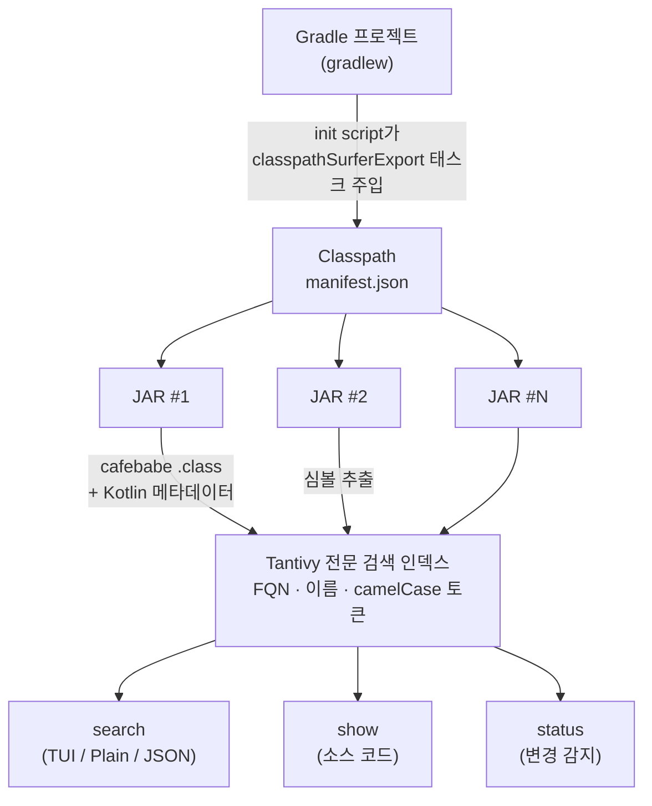

<div align="center">

# classpath-surfer

**Gradle Java/Kotlin 프로젝트를 위한 고속 의존성 심볼 검색**

[](https://github.com/rscarrera27/classpath-surfer/actions/workflows/ci.yml)
[](LICENSE)
[](https://www.rust-lang.org/)

해석된 classpath에 포함된 모든 클래스, 메서드, 필드를 인덱싱하고,<br>
CLI나 [Claude Code](https://claude.ai/claude-code)에서 즉시 검색할 수 있습니다.

[English](README.md) | [한국어](README_ko.md)

<!-- TODO: 데모 GIF 추가 — asciinema + agg로 TUI 검색 + show 녹화 -->

</div>

> [!WARNING]
> 이 프로젝트는 **알파** 단계입니다. API, CLI 플래그, 인덱스 포맷, 설정 스키마가 예고 없이 호환성이 깨지는 방식으로 변경될 수 있습니다. 사용에 유의하시고, 버그 리포트와 피드백은 언제든 환영합니다!

---

## 왜 필요한가요?

코딩 에이전트(Claude Code 등)가 Gradle Java/Kotlin 프로젝트에서 외부 라이브러리 심볼을 탐색할 때, `~/.gradle/caches/`를 무차별 탐색하거나, 실제 classpath와 무관한 아티팩트에 접근하거나, source JAR이 있는데도 디컴파일을 시도하는 등 비효율적인 행동을 반복합니다. 게다가 이 과정을 매번 처음부터 추론해야 합니다.

**classpath-surfer**는 해석된 classpath의 모든 심볼을 [Tantivy](https://github.com/quickwit-oss/tantivy) 기반 로컬 전문 검색 인덱스로 만들어 이 문제를 해결합니다. 에이전트와 사람 모두 심볼 검색과 소스 코드 열람을 즉시 수행할 수 있습니다.

## 주요 기능

| | 기능 | 설명 |
|---|------|------|
| :mag: | **심볼 검색** | 자동 FQN 감지, CamelCase 토큰 분리, 접두사 매칭을 지원하는 스마트 검색 — 종류, 의존성, 접근 수준, 설정 스코프별 필터링 |
| :zap: | **고속 인덱싱** | Gradle 프로젝트의 classpath를 자동 추출하여 수초 내 전체 인덱싱, GAV 단위 diff로 변경분만 증분 갱신 |
| :globe_with_meridians: | **코틀린 시그니처** | `@kotlin.Metadata` protobuf 디코딩으로 `suspend fun`, `data class` 등 코틀린 네이티브 시그니처 제공 |
| :package: | **JVM 언어 범용** | Java, Kotlin, Scala, Groovy, Clojure — 어떤 JVM 언어로 작성된 의존성이든 심볼 검색 가능 |
| :page_facing_up: | **소스 코드 조회** | 심볼에 자동 포커싱하여 전후 컨텍스트 표시; source JAR이 있으면 원본 소스, 없으면 CFR/Vineflower로 온디맨드 디컴파일 — Kotlin은 원본 `.kt` 소스와 디컴파일된 Java 뷰 함께 제공 |
| :robot: | **AI 에이전트 연동** | 모든 AI 에이전트를 위한 `--agentic` JSON 출력과 분류된 exit code; Claude Code 플러그인으로 스킬 추가 가능 |

## 빠른 시작

### 설치

> [!NOTE]
> 현재 사전 빌드된 바이너리는 **Apple Silicon (aarch64)** 에서만 제공됩니다. 다른 플랫폼이나 소스 빌드 방법은 [CONTRIBUTING_ko.md](CONTRIBUTING_ko.md)를 참고하세요.

```bash
brew install rscarrera27/tap/classpath-surfer
```

### 프로젝트 설정

```bash
cd your-gradle-project
classpath-surfer init      # 설정 파일, Gradle init script 설치 후 초기 refresh 실행

# 인덱스가 정상적으로 생성되었는지 확인
classpath-surfer status
# → 38 dependencies, 77,219 symbols indexed, 2.1 MB on disk
```

### 심볼 찾기

```bash
# "ImmutableList가 어떤 패키지에 있지?" — 이름만으로 검색
classpath-surfer search ImmutableList

# "Immutable 뭔가가 있었는데…" — CamelCase 토큰 단위로 매칭
# ImmutableList, ImmutableMap, ImmutableSet 등이 모두 검색됨
classpath-surfer search Immutable

# "kotlinx-coroutines에서 코루틴 시작하는 함수가 뭐였지?"
classpath-surfer search launch --type method --dependency "org.jetbrains.kotlinx:*"

# "Guava에 어떤 심볼이 있는지 전부 보여줘"
classpath-surfer search --dependency "com.google.guava:guava"

# "HTTP 클라이언트 관련 클래스 전부 보여줘"
classpath-surfer search "Http.*Client" --regex --type class

# "compile에서만 보이는 어노테이션 찾기"
classpath-surfer search Annotation --type class --scope compileClasspath

# FQN도 그대로 넣으면 자동 감지
classpath-surfer search com.google.common.collect.ImmutableList
```

### 소스 코드 보기

```bash
# 심볼 소스 보기 — 해당 심볼 전후 25줄에 자동 포커싱
classpath-surfer show com.google.common.collect.ImmutableList
classpath-surfer show com.google.common.collect.ImmutableList.of

# 컨텍스트 넓히기 / 전체 파일 보기
classpath-surfer show com.google.common.collect.ImmutableList --context 50
classpath-surfer show com.google.common.collect.ImmutableList --full

# Kotlin 소스는 원본 .kt 파일로 표시 (suspend fun, data class 등)
classpath-surfer show kotlinx.coroutines.CoroutineScope
```

Source JAR가 있으면 원본 소스를, 없으면 CFR/Vineflower로 자동 디컴파일합니다.

### 의존성 탐색

```bash
# 인덱스된 의존성 목록 — 각 의존성의 심볼 수와 scope 표시
classpath-surfer deps

# Netty 관련 의존성만 필터
classpath-surfer deps --filter "io.netty:*"

# runtime에만 포함된 의존성 확인
classpath-surfer deps --scope runtimeClasspath
```

### AI 에이전트 / 스크립트 연동

```bash
# 모든 커맨드에 --agentic을 붙이면 구조화 JSON 출력
classpath-surfer search ImmutableList --agentic
classpath-surfer show com.google.common.collect.ImmutableList --agentic

# 비-TTY에서는 자동으로 Plain 텍스트 출력 (파이프 친화적)
classpath-surfer search ImmutableList | head
```

## 커맨드

| 커맨드 | 설명 |
|--------|------|
| `init` | Gradle init script, 기본 설정 후 초기 refresh 실행 |
| `refresh` | Gradle로 classpath 추출 후 심볼 인덱스 빌드/업데이트 (인덱스 최신 시 Gradle 생략; `--force`로 강제) |
| `search <query>` | 인덱스에서 심볼 검색 |
| `show <fqn>` | 특정 심볼의 소스 코드 표시 (기본적으로 대상 심볼에 포커싱) |
| `deps` | 인덱스된 의존성 목록과 심볼 수 표시 |
| `status` | 인덱스 상태 표시 (의존성 수, 심볼 수, 변경 여부, 디스크 크기) |
| `clean` | 인덱스 데이터 삭제 |
| `--agentic` | 글로벌 플래그: AI 에이전트 및 스크립트용 구조화 JSON 출력 |

## 성능

Macbook Pro 2023(M2 Pro, 32GB)에서 38개 의존성 프로젝트(77,219 심볼 — Guava, Spring Core, Ktor, kotlinx-coroutines, OkHttp 등 포함) 기준 벤치마크:

### 검색 지연 시간

| 쿼리 유형 | 지연 시간 |
|----------|----------|
| 단순 키워드 (`ImmutableList`) | **83 µs** |
| FQN 정확 매칭 | **10 µs** |
| 정규식 (`Immutable.*`) | **350 µs** |
| 타입 필터 적용 | **73 µs** |
| 의존성 필터 적용 | **92 µs** |

### 인덱싱 속도

| 작업 | 소요 시간 |
|------|----------|
| 전체 refresh (38개 의존성, 77K 심볼) | **1.76 s** |
| 증분 refresh (1개 의존성 제거) | **607 ms** |
| No-op refresh (변경 없음) | **537 ms** |

<details>
<summary>벤치마크 재현 방법</summary>

```bash
cargo bench --bench search
cargo bench --bench refresh
```

</details>

## 동작 원리



1. **추출** — Gradle init script가 모든 서브프로젝트의 `compileClasspath`와 `runtimeClasspath`를 해석하고, 각 의존성의 GAV 좌표와 JAR 경로(소스 JAR 포함)를 모듈별 JSON 매니페스트로 기록합니다.
2. **파싱** — `cafebabe` 크레이트로 각 JAR을 열어 모든 `.class` 파일에서 클래스명, 메서드, 필드, 디스크립터, 접근 플래그를 추출합니다. Kotlin 클래스의 경우 `@kotlin.Metadata` 어노테이션을 protobuf(prost)로 디코딩하여 Kotlin 네이티브 시그니처를 생성합니다. `SourceFile` 속성으로 소스 언어를 판별합니다.
3. **인덱싱** — 추출된 심볼을 FQN, 단순 이름, camelCase 분리 토큰, 종류, 시그니처, GAV 필드와 함께 Tantivy 인덱스에 기록합니다.
4. **검색** — 쿼리가 Tantivy 인덱스를 조회합니다. 결과는 관련도 순으로 정렬되어 테이블 또는 JSON으로 반환됩니다.
5. **변경 감지** — 검색 시마다 lockfile 해시와 빌드 파일 수정 시간을 인덱싱 당시의 스냅샷과 비교합니다. 변경이 감지되면 `refresh`를 요청합니다.

## Claude Code 통합

classpath-surfer는 [Claude Code 플러그인](https://claude.ai/claude-code)으로 세 개의 스킬을 제공합니다:

| 스킬 | 용도 |
|------|------|
| `/find-symbol <name>` | 심볼을 검색하고 결과를 테이블로 표시 |
| `/show-source <fqn>` | 정규화된 이름으로 소스 코드 표시 |
| `/refresh-deps` | 버전 변경 후 의존성 재인덱싱 |

### 플러그인 설치

```bash
# Claude Code 내에서
/plugin marketplace add github.com/rscarrera27/classpath-surfer
/plugin install classpath-surfer
```

Claude Code가 외부 의존성 API를 직접 탐색하고 읽을 수 있게 해줍니다.

## 설정

`classpath-surfer init`이 `.classpath-surfer/config.json`을 생성합니다:

```json
{
  "decompiler": "cfr",
  "decompiler_jar": null,
  "configurations": ["compileClasspath", "runtimeClasspath"],
  "java_home": null,
  "no_decompile": false
}
```

| 필드 | 설명 |
|------|------|
| `decompiler` | `"cfr"` 또는 `"vineflower"` |
| `decompiler_jar` | 디컴파일러 JAR 경로. 미설정 시 `CFR_JAR` 또는 `VINEFLOWER_JAR` 환경 변수 사용 |
| `configurations` | 해석할 Gradle 설정 |
| `java_home` | `JAVA_HOME` 오버라이드 (디컴파일러 실행 시 사용) |
| `no_decompile` | `false` (기본값). `true`이면 source JAR이 없을 때 디컴파일 대신 실패 |

CLI 플래그(`--decompiler`, `--configurations`, `--no-decompile`)가 설정 파일 값을 오버라이드합니다.

## 요구사항

- **Gradle** 프로젝트 (`gradlew` 또는 `PATH`에 `gradle`)
- **JDK** (`show` 커맨드의 디컴파일 기능 사용 시에만 필요)

소스 빌드 요구사항은 [CONTRIBUTING_ko.md](CONTRIBUTING_ko.md)를 참고하세요.

## 기여

기여를 환영합니다! 자세한 내용은 [CONTRIBUTING_ko.md](CONTRIBUTING_ko.md)를 참고하세요.

## 라이선스

[Apache License, Version 2.0](LICENSE)으로 배포됩니다.

---

<div align="center">
<sub>Designed by a human. Built by <a href="https://claude.ai/claude-code">Claude Code</a>.</sub>
</div>
